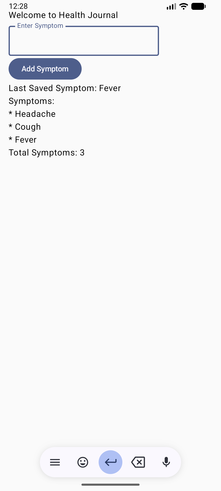

# Health Journal

A healthcare-focused Android learning project built with Kotlin and Jetpack Compose.

This project is part of my Android Development journey, where I learn Android concepts by building real applications instead of only following tutorials. The goal is to gradually evolve this project from a simple symptom tracker into a production-ready healthcare application.

---

## Current Features

- Welcome Screen
- Symptom Input using OutlinedTextField
- Add Symptom Button
- Save and Display Last Saved Symptom
- Multiple Symptom Storage
- Dynamic Symptom List
- Real-time UI Updates with Compose State
- Symptom Counter
- Row, Column, and Box Layouts

---

## Tech Stack

- Kotlin
- Jetpack Compose
- Android Studio
- Git
- GitHub

---

## Screenshots

### Day 3 - Symptom List with Layout Components

  

Features demonstrated:

- Column Layout
- Row Layout
- Box Layout
- Dynamic Symptom List
- State Management with `mutableStateListOf`
- Automatic Symptom Counter

---

## Progress Tracker

### Completed

- [x] Android Project Setup
- [x] Welcome Screen
- [x] TextField
- [x] OutlinedTextField
- [x] Button
- [x] State Management with `mutableStateOf`
- [x] Save and Display Last Symptom
- [x] Multiple Symptom Storage
- [x] Dynamic Symptom List
- [x] Column Layout
- [x] Row Layout
- [x] Box Layout
- [x] Symptom Counter
- [x] GitHub Repository Setup
- [x] First Commits and Version Control
- [x] README Documentation
- [x] Project Screenshots

### In Progress

- [ ] Better UI Design
- [ ] Improved Padding and Spacing
- [ ] Symptom History Improvements

### Planned

- [ ] Navigation
- [ ] Room Database
- [ ] MVVM Architecture
- [ ] Retrofit Integration
- [ ] Hilt Dependency Injection
- [ ] Android Testing
- [ ] Android FHIR SDK
- [ ] Health Record Management

---

## Learning Objectives

Through this project, I aim to learn and implement:

- Kotlin Fundamentals
- Jetpack Compose UI Development
- State Management
- Navigation
- MVVM Architecture
- Room Database
- Retrofit API Integration
- Dependency Injection with Hilt
- Android Testing
- Healthcare App Development
- Android FHIR SDK

---

## Project Roadmap

### Version 0.1

- Welcome Screen
- Symptom Input
- Add Symptom Button
- Save and Display Last Symptom

### Version 0.2 (Current)

- Multiple Symptom Storage
- Dynamic Symptom List
- Symptom History Display
- Symptom Counter
- Row Layout
- Column Layout
- Box Layout

### Future Versions

- Navigation Between Screens
- Local Storage with Room Database
- MVVM Architecture
- API Integration using Retrofit
- Dependency Injection using Hilt
- User Authentication
- Health Record Management
- FHIR-Based Healthcare Features

---

## What I Learned So Far

### Day 1

- Kotlin Fundamentals
- Jetpack Compose Text
- TextField
- Button
- Basic State Management
- Android Project Structure
- GitHub Repository Setup

### Day 2

- OutlinedTextField
- State Updates in Compose
- Displaying Dynamic Data on Screen
- Git Commit vs Git Push
- Resolving a Non-Fast-Forward Git Conflict
- Exploring Production Android Projects
- Exploring Open Source Android Repositories

### Day 3

- Kotlin Lists in a Real Project
- `mutableStateListOf`
- Column Layout
- Row Layout
- Box Layout
- Dynamic UI Rendering
- Displaying Multiple Items from a List
- Building Data-Driven Screens in Jetpack Compose

---

## Why This Project?

Healthcare and AI are areas that deeply interest me.

This project serves as a practical learning platform where I can apply Android development concepts while moving toward building healthcare-focused technology solutions.

Every new concept I learn is implemented in this project and documented through GitHub commits.

---

## About the Author

**Sahil** is a B.Tech Computer Science student, aspiring software engineer, and future tech entrepreneur interested in AI, robotics, healthcare innovation, and Android development.

This project is part of a long-term journey to build technology solutions that solve real-world challenges in healthcare and education.

---

## Connect With Me

- GitHub: https://github.com/Mdsahil01
- LinkedIn: https://linkedin.com/in/mdsahil01

---

## Project Status

🚧 Currently under active development as part of my Android Development learning journey.

Every new concept learned is implemented in this project, committed to GitHub, and documented through project updates.